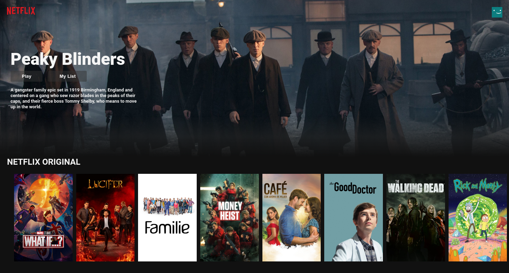

# NETFLIX CLONE

This is a front-end clone of Netflix. 


## Demo

https://netflix-clone-28008.web.app/
  

 

# Technolgies Used:


- [Nodejs](https://nodejs.org/en/)

- [Reactjs](https://reactjs.org/)

- [React Youtube](https://www.npmjs.com/package/react-youtube)
- [Axios](https://www.npmjs.com/package/axios)

Api used from
[TMDB Movie Api](https://www.themoviedb.org/documentation/api)


## Deployment
To deploy to [Firebase](https://firebase.google.com/?gclid=Cj0KCQjwnJaKBhDgARIsAHmvz6dcAu83sOCz909F86VdygwoSC6-36wVgNZOIUj34xtD_aAafnuFzE4aApe-EALw_wcB&gclsrc=aw.ds)

- firebase login
- firebase init
  - Hosting
  - Use existing project
  - build
  

```bash
  npm run build
```
Builds the app for production to the `build` folder.

  
# Credits

[Clever Programmer-Netflix-Clone Youtube](https://www.youtube.com/channel/UCqrILQNl5Ed9Dz6CGMyvMTQ)
